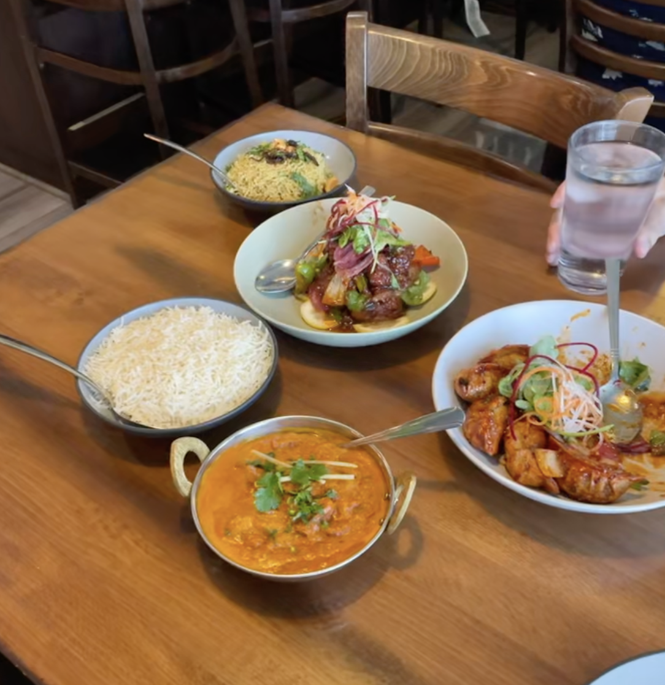

+++
date = '2025-07-28T16:21:20-04:00'
draft = false
title = 'Everest Sherpa Restaurant'
tags = ['Ann Arbor']
+++

# Everest Sherpa Restaurant

[https://www.everestsherparestaurant.com/](https://www.everestsherparestaurant.com/)

Ann Arbor, Michigan

If you're going to Ann Arbor for a weekend, I would 100% recommend Everest Sherpa Restaurant. Away from downtown A2, Everest Sherpa is by a Target and (RIP) Joanne's fabric in a strip mall. It is probably my favorite restaurant in the city. Their summer specials have all changed my life for the better.
* Dal Makhani (special): a creamy, savory delicious dish that haunts my dreams
* Vegetable Momos: the best dumplings in the world. Always a treat!!
* Chili Momos (special): The amazing momos but somehow even better?? A sweet & spicy chili sauce that is truly incredible.
* Coconut Tofu Curry (special): Light, creamy, airy delicious coconut curry that I CRAVE like nothing else. So incredible.
* Mango Lassi: I just always love mango lassi but this one is particularly delicious.
* Masala Mint Lemonade: This lemonade is POWERFUL. It's spicy and sweet in all the best ways.

If you like meat I think Sam had the tandoori chicken and it looked really good (I think?) and he also loves the chicken tikka masala (white people classic).

I get everything mild because I'm a wimp but I'll get the momos medium for my Sam. He always gets medium because he has a real spice tolerance.

I also think that everyone who works here is amazing? The staff is always so sweet and kind. It's also nice to go to a place where I see lots of families enjoying a meal together. Maybe I'm a boring individual but I love a family friendly establishment.

<!-- Shitty photo -->

Anyways you should go here. It is perhaps the restaurant I will miss most in Ann Arbor.